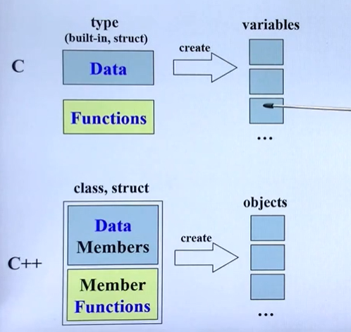
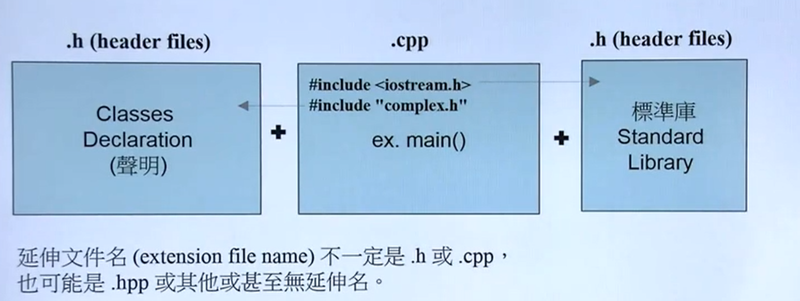

# 二、头文件和类的声明

## 1. C vs C++ 关于数据和函数

**C语言中**：语言本身没有提供某些关键字，各个函数都可以处理这些数据，会对之后的编程造成很大的影响

**C++语言中:** 将数据和函数包在一起，只有包在你面的函数才可以访问这些数据



## 2. 对于class分类的两大经典例子

一类带指针的class和一类不带指针的class

### 2.1 不带指针的class

complex（复数）

把数据和函数包在一起，数据有很多份，但是函数只有一份


创建复数的代码：

```c++
complex c2(2,1);
compex c2;
complex* pc = new complex(0,1);
```

### 2.2 带指针的class

string(字符串)

每一个对象里面其实只有一个指针


创建复数的代码：

```c++
string s1("hello");
string s2("world");
string* ps = new string;
```

## 3. C++代码的基本形式



- 编译器会自动找到标准库的头文件，不需要自己查找

  

  - C++的输出不需要指明输出是什么类型，而C语言需要告诉printf类型
  - iostream.h 可以没有.h后缀，视编程平台而定】

  

  ## 4. Header(头文件)中的防卫式声明

  **防卫式声明的意义：**

  很多程序需要用到这个头文件，如果要求用的人按照顺序引入头文件（如先 include A 再 B再C),这样非常不利于使用。

  为了让人使用的时候想怎么include都行，需要加入这个防卫式声明

  ```c++
  #ifndef __COMPLEX__ //如果没有定义这个 if not define = ifndef
  #define __COMPLEX__ //就把它定义出来，当定义过的时候就不会进到主题，这样就不会有重复include的问题
  .....
  # endif
  ```

  

  ## 5.Header(头文件)的布局

  

  ### class的声明（declaration）

  以一下复数的类为例子，类包含了一下几个部分：

  - class head 
  - class body

  

  ### 模板的简介

  在这个复数的类中， 我们设置是不和虚部为double类型，然而在实际我们用的时候可能是float 也可能是 int 。 因此就要重新写一个和上面重复度非常高的类，知识修改了实部虚部的数据类型。这样是一个非常重复的做法，因此C++设计了模板

  

  上述例子就是告诉编译器，我并没有决定T是什么类型，T类型未定。**当使用的时候才绑定指定的类型！**

  

