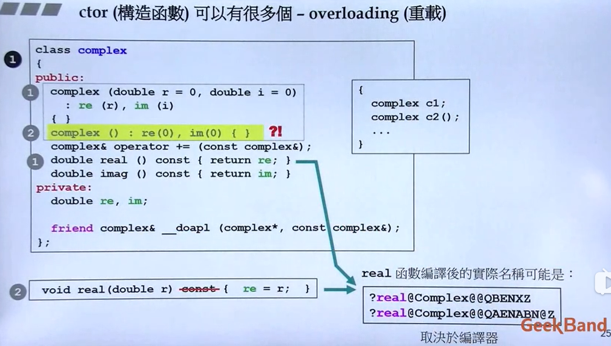

# 三、构造函数

```c++
class complex //class head
{ //{} class body
public:
	complex (double r=0, double i=0): re(r), im(i){}
	complex& operator += (const complex&); //函数的声明，函数的本体在body之外定义
	double real() const { return re; }
	double imag() const { return im; }
private:
	double re, im;
	friend complex& __doapl(complex*, const complex&);
};
```

## 1. inline（内联）函数

函数在class本体里面定义就行成了一种inline, 如果在外头定义就不是inline

inline 像宏(macro)一样，有他的特性而没有他的缺点，**如果你的函数是一个inline function，那样会很好！**

- 但是有些function你把它写成inline，编译器也并不认为他是inline函数，编译器没有能力把它定义为inline function
- 简单来说就是当函数太复杂的时候就没有办法inline
- 所以原则上是可以全部写成inline，但是实质上是不是inline是由编译器判断的

```c++
class complex //class head
{ //{} class body
public:
	complex (double r=0, double i=0): re(r), im(i){}
	complex& operator += (const complex&); //通过（）可以看出这个函数是在本体外定义的，这里只是声明
    
    // real 和 imag函数足够简单，可以看为是inline function
	double real() const { return re; } //函数若在class body 内定义完成，便自动称为inline候选人
	double imag() const { return im; } //函数在class本体里面定义就行成了一种inline
private:
	double re, im;
	friend complex& __doapl(complex*, const complex&);
};
// 下面的暂时不看
inline double
imag(const complex& x)
{
    return x.imag();
}
```

## 2. access level（访问级别）

- public
  - 函数如果需要给外部使用那就是public
  - 不需要就可以设为private
- private
  - 一般类别中的数据都是private的，数据不希望被外界随意访问
- protect （暂时不讲）

```C++
class complex 
{
public: //公共的
	complex (double r=0, double i=0): re(r), im(i){}
	complex& operator += (const complex&); 
	double real() const { return re; } 
	double imag() const { return im; } 
private: //私有的
	double re, im;
	friend complex& __doapl(complex*, const complex&);
};
// private中的数据和函数是不能直接访问的
// complex c1(2,1);
// cout << c1.re; cout << c1.im; //这样直接访问类中的私有数据是错误的

// 因此要访问私有的数据，我们可以通过设置公共函数去访问
complex c1(2,1);
cout << c1.real(); cout << c1.imag(); //通过函数访问获取私有数据值

```

## 3. constructor（ctor, 构造函数）

#### 3.1 基本概念

C++语言定义，**如果你想要创建一个对象的话，有一个函数会自动被调用起来，这个就是构造函数**

- 构造函数的函数名称一定要和类的名称相同
- 构造函数没有返回类型 就是comoplex... 它就是返回complex类，所以C++认为不必要写返回类型
- 构造函数的大气正规赋值写法：（冒号写法）
  - complex (double r=0, double i=0) **: re(r), im(i)** {} 
  - 为什么要直接冒号后赋值，而不在{}内赋值呢？
    - 一个变量数值的设定有两个阶段，一个是初始化，第二个是赋值。**如果不在冒号处写，就等于放弃了初始化的阶段，虽然最后把值放进去了，但是时间也晚了一些，效果也差了一些！**

C++中还有一个析构函数，暂时不详细展开

- 一般情况下不带指针的类，**多半不用写**析构函数

```c++
class complex 
{
public: 
   //默认实参(double r=0, double i=0)
	complex (double r=0, double i=0)
        : re(r), im(i)  // initialization list （初值列，初始列）
    {}  //构造函数的函数名与类名相同，且没有返回类型
    /*
    //没有那么大气的写法，且效率上会比较差
    complex (double r=0, double i=0)
    {
    	re=r;im=i; //这个就是assignments赋值
    }
    */
	complex& operator += (const complex&); 
	double real() const { return re; } 
	double imag() const { return im; } 
private: 
	double re, im;
	friend complex& __doapl(complex*, const complex&);
};
//三种不同的创建对象方法
//创建对象的时候就会自动调用构造函数
complex c1(2,1);
complex c2; //直接调用默认值
complex* p = new complex(4); //用一种动态的方式去创建对象，得到的回事一个指针
```

#### 3.2 ctor(构造函数)可以有多个-overlording(重载)

创建想的时候可能有很多想法，所以可以有多个构造函数。C语言中是不允许同一个函数名有三个函数的，但是C++允许。

相同函数名称的函数有一个以上，这样就叫做重载。



- 以下面那组1、2标号所指函数为例 及两个real函数

  - complex类中的函数和类中的函数虽然同名，但实际上real函数经过编译后的名字是不一样的。及其会把函数的名称，函数里面的参数，返回类型统统都编码成及其可以看得懂的名字。所以实际上编译后名字是不相同的！

  - 注意:函数外的real函数要去掉const：

    ```c++
    void real(double r) {return r;}
    ```

- 以上面的1、2为例，及两个同名的complex构造函数

  - 这样是不可以的，因为第一个complex的参数有默认参数

    ```c++
    // 这两种创建类会让编译器疑惑，到底该加载哪个构造函数
    complex c1; //对于第一个有默认值的构造函数可以传入，第二个无参数的构造函数也可以传入，产生冲突
    complex c2();
    ```

    