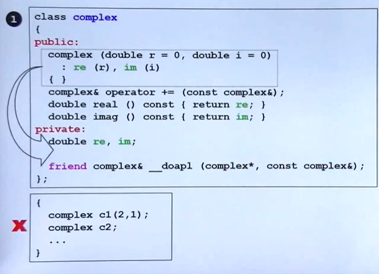
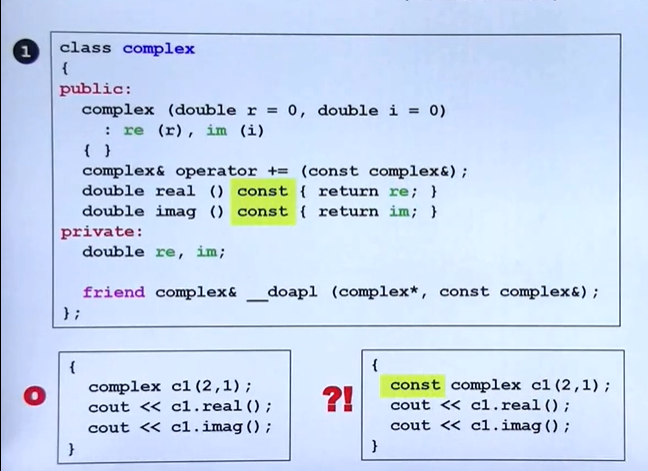
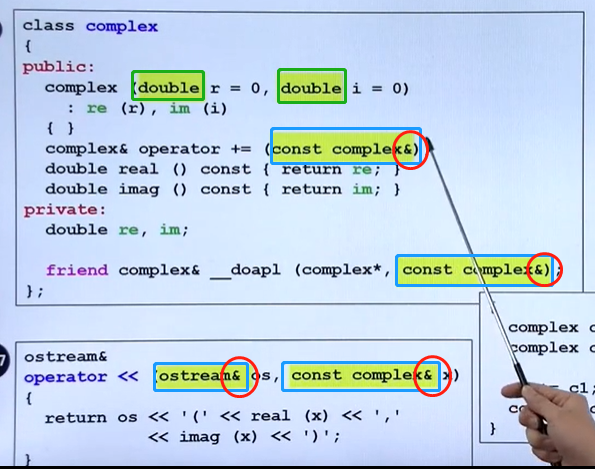
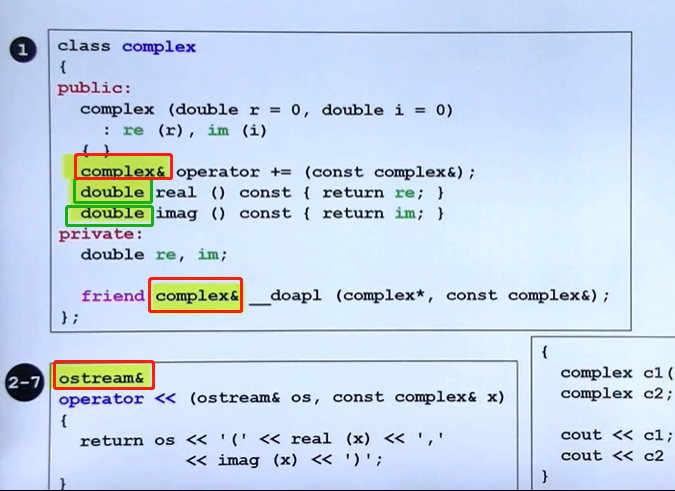
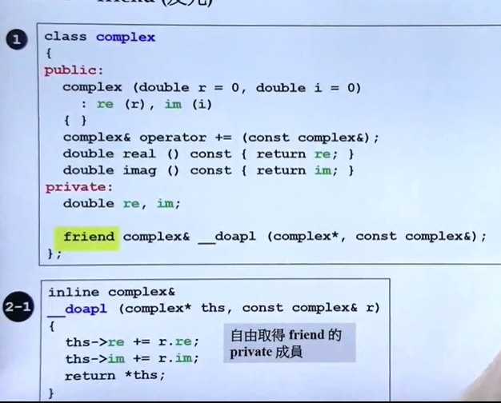
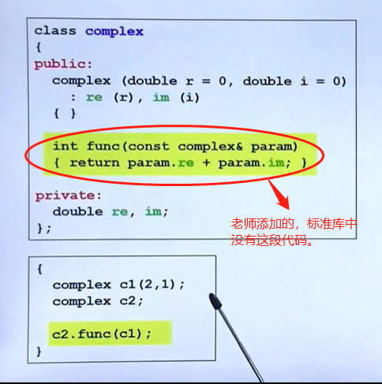
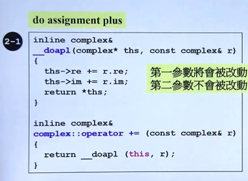

# 四、参数传递与返回值

## 1. ctor（构造函数）放在private区

- 将构造函数迁移到private区域的时候，及在外部不能构造complex对象，因为构造函数在private外部无法访问！

  




当我们设计这类构造函数在private区域的类时就表明这个类就不允许被外界创建对象

- 在设计模式中的**Singleton（单例）**中就是构造函数在私有区

  ```c++
  class A{
  public:
      static A& getInstance();
      setup(){...}
  private:
      A(); //构造函数在private中
      A(const A& rhs);
  };
  
  A& A::getInstance(){
  static A a;
  return A
  }
  //使用的话需要用setup
  A：：getInstance().setup();
  ```

## 2. const member functions常量成员函数

在函数的后头加上const ，在（）的后面在 { }的前面

class里面的函数分为会改变数据的和不会改变数据内容两种形式：

- **当函数不改变函数内容的时候，一定要加上const**
- **不加const的时候当使用者用使用const complex定义的时候，就会产生矛盾**！
  - 使用者不像右下角那样使用虽不会保存，但是也表明了不加const的类本身考虑不够周全



## 3. 参数传递：pass by value vs. pass by reference( to const)



### 3.1使用value值作为参数传递：

**没有&符号，就是基础类型** 如图中的绿色方框都是pass by value

- pass by value是将数据整包传过去，value 多大就整包传过去，传递的过程就是把数据传递到堆栈中。
- 如果double是四个字节就是传四个字节，也有些自定义类型100个字节，就是100个字节。**所以pass by value效率是不高的**

### 3.2使用reference值作为参数传递：

**有&符号，就是基础类型** 如图中的蓝色方框都是pass by reference

- 在C语言中有指针，**而C++有一个更漂亮的东西&引用。引用的底部就是一个指针，所以传引用就相当于传指针那么的快**
- 所以最好所有的参数传递都最好传引用！传引用会比较快！当然如果是传递字符的话，pass by value只有一个字节，反而更快。但是这是一个比较细节的考虑，这样没错。**但是遵循大的准则来看，传引用都是一个不错的选择。**

#### 注意：pass by reference (to const)

传引用等于就把自己传递过去，如果函数一改，就等于改了数据本身**。所以当你知道传过去只是为了速度，且不希望data的数值被改变，那么就可以传递引用 to const !**

```c++
complex& operator += (const complex&) //引用前const修饰，我传给你的参数不允许被更改
```

### 3.3 总结

**参数传递尽量都用引用，当传过去的参数不想被更改的时候就加const !**


## 4.返回值传递：return by value vs. return by reference(to const)

返回值的传递也尽量by reference

- 绿色部分为return by value
- 红色部分为return by reference



## 5.friend(友元)

友元函数可以获取类里面的私有数据， 友元函数的存在就等于打开了封装。

```c++
friend complex& __doapl (complex*, const complex&)； //这个函数就是友元函数
```



## 6.相同class 的各个objects互为friends(友元)

假设有两个对象AB, 通过func函数，对象A就可以去拿对象B的私有数据re和im

- 解释：同一个class产生的各个object互为朋友



## 7.class外的各种定义（definitions)什么时候可以pass by reference ，什么时候可以return by reference



## 7.总结

**当设计一个类的时候，需要注意以下几点：**

- 数据一定要放在private中
- 传递参数的时候尽量以reference来传递
  - 需不需要const看状况
- 返回值也尽量以reference来传递
- 在类的本体body里面的函数如果返回的数据不被改动的要加const就尽量要加
- 构造函数的initialization list 一定要用（：)这一行

