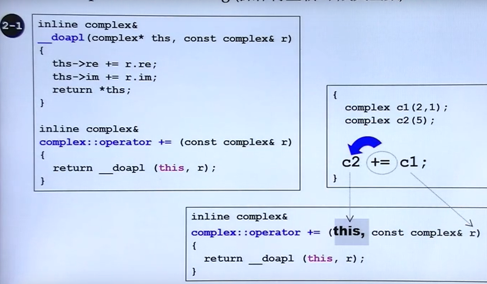

# 五、操作符重载与临时变量

## 1. operator overloading(操作符重载—成员函数) this

- **任何成员函数都有一个隐藏的this pointer，这个pointer指向调用者**，谁调用我这个成员函数，这个this就指向他



```c++
# include <iostream>
using namespace std;

class complex
{
public:
	complex (double r =0, double i=0) : re(r), im(i){}
	complex& operator += (const complex&);
	double real() const { return re; }
	double imag() const { return im; }
private:
	double re, im;
	friend complex& __doapl(complex*, const complex&);
};

// do assignment plus
// 左操作数是一个指针
inline complex& __doapl(complex* ths, const complex& r)
{
	ths->re += r.re;
	ths->im += r.im;
	return *ths ; //返回的是指针所指的东西，返回一个object
    // 可是返回的声明是一个引用，
}
// 其实等于有两个参数（this, const complex& r) this是隐藏的
inline complex& complex::operator += (const complex& r)

{
    // 不直接在这里计算的原因是可能还有其他也可以用到线性相加，所以把这个传给
    // do assignment 加法这个函数来计算
	return __doapl(this, r);
}
```

